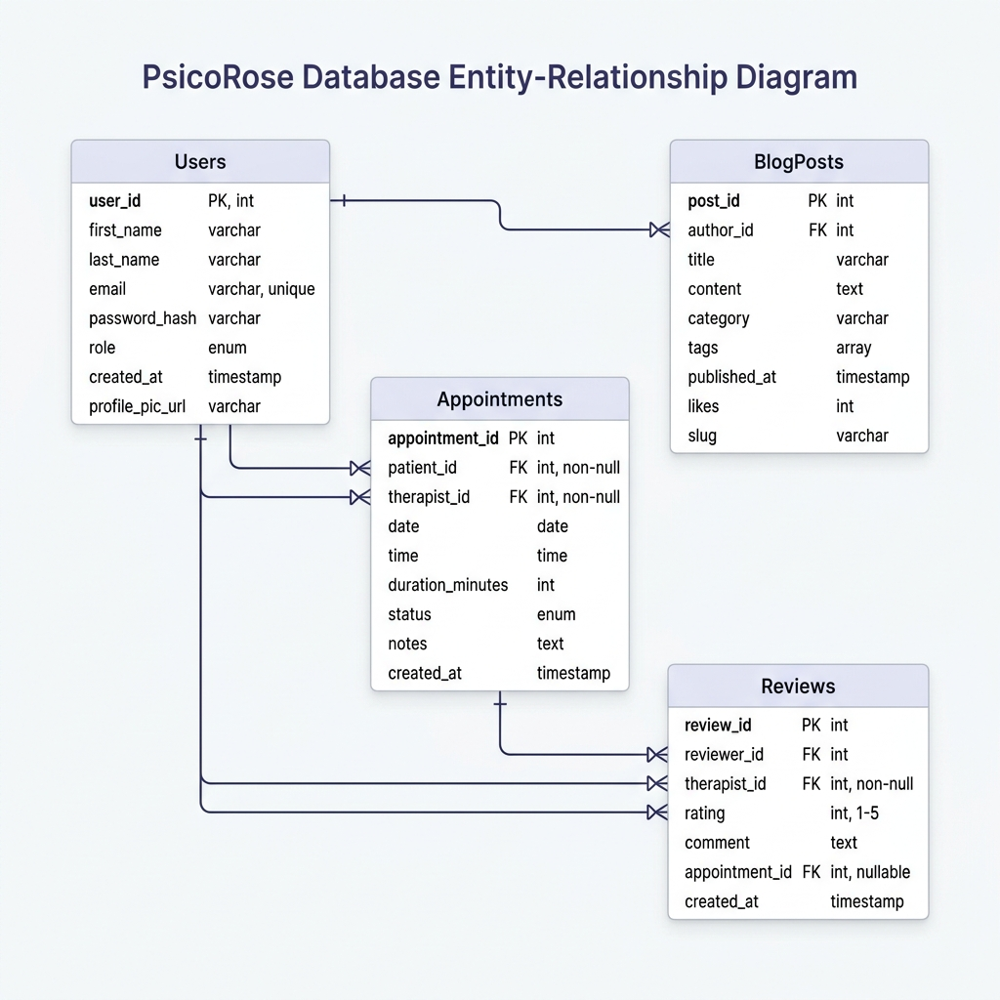

#  Modelo Entidad-Relación (ER) - PsicoRose

Este documento describe la arquitectura de datos de la plataforma PsicoRose. 

---

## 1. Diagrama de Datos

---

## 2. Descripción de las Colecciones

### 2.1 Usuarios (`users`)
Es la entidad central. Almacena tanto a los pacientes como a la administradora (Rosa). La distinción de permisos se gestiona mediante el campo `role`.

### 2.2 Citas (`appointments`)
Gestiona el núcleo del negocio. Tiene una relación **1:N** con Usuarios (un usuario puede tener muchas citas). Incluye el campo `reminderSent` para evitar que el flujo de **n8n** envíe múltiples correos para la misma sesión.

### 2.3 Artículos de Blog (`blogposts`)
Permite la gestión de contenidos. Relacionado con un autor (generalmente el Admin) para mantener la trazabilidad de las publicaciones.

### 2.4 Reseñas (`reviews`)
Almacena el feedback de los pacientes. Cada reseña está vinculada obligatoriamente a un usuario registrado para garantizar la veracidad de los testimonios.

---

## 3. Integridad de Datos
- **Referencias**: Se utilizan `ObjectIds` de Mongoose para vincular documentos entre colecciones.
- **Validaciones**: Se implementan validaciones a nivel de esquema (required, unique, min/max) para asegurar que no existan datos inconsistentes en la base de datos.
