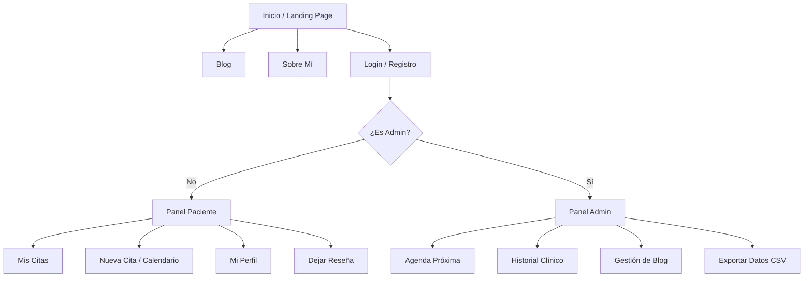

# 🗺️ Mapa de Navegación - PsicoRose

Este documento describe la estructura jerárquica y el flujo de navegación de la plataforma PsicoRose, dividiendo la experiencia según el rol del usuario (Paciente o Administrador).

## 1. Diagrama de Flujo

## 2. Descripción de Secciones

### Nivel 1: Acceso Público
*   **Landing Page**: Presentación del servicio, testimonios y llamadas a la acción (CTA).
*   **Blog**: Listado de artículos de salud mental escritos por la Dra. Rosa.
*   **Sobre Mí**: Trayectoria profesional y filosofía de trabajo.
*   **Autenticación**: Formularios de acceso y creación de cuenta con validación JWT.

### Nivel 2: Área del Paciente (Dashboard)
*   **Mis Citas**: Visualización de citas confirmadas y pendientes. Permite la cancelación.
*   **Nueva Cita**: Proceso de reserva con selector de fecha y hora sincronizado con la disponibilidad real.
*   **Perfil**: Gestión de datos personales y avatar.

### Nivel 3: Área de Gestión (Admin Dashboard)
*   **Agenda Próxima**: Vista optimizada para el día a día de Rosa (solo citas futuras).
*   **Historial Clínico**: Base de datos de todas las sesiones pasadas con filtro de búsqueda por paciente.
*   **Panel de Blog**: Editor para crear, editar o eliminar entradas del blog.

---

## 3. Lógica de Redirección
1.  **Protección de Rutas**: Si un usuario intenta acceder a `/admin` sin rol de administrador, el sistema lo redirige automáticamente a su panel de usuario.
2.  **Persistencia**: El sistema recuerda la sesión del usuario mediante un Token JWT almacenado en `localStorage`, evitando logins repetitivos.
